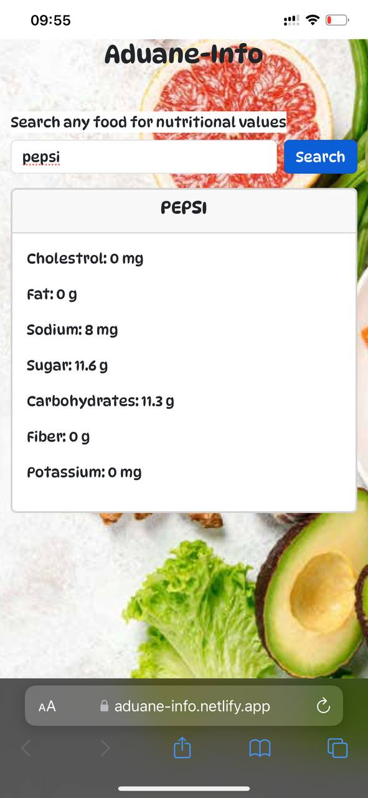

# ADUANE-INFO

Aduane-Info is an app that allows you to search for the nutritional value of any food, fruit, vegetable or beverage.

You can combine foods in the search and get results of their nutritional information

- [Aduane-Info](https://aduane-info.netlify.app/) This is a live link to Aduane-Info

# Overview
- Aduane-Info is a simple app designed to assist you know the nutrional value of whatever you consume.
- Aduane-Info provides you with main nutrients and their values per mg or g.
- Search results include Fruits, Vegetables, Drinks and Beverages, Full Meals and many more

# Features
Nutrients Displayed:
- Fat
- Sodium
- Cholesterol
- Sugar
- Carbohydrates
- Fiber
- Potassium

# Screenshots

# Contact
For any questions or suggestions, please contact me on [Twitter](https://twitter.com/_02ahmed)